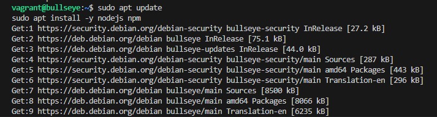
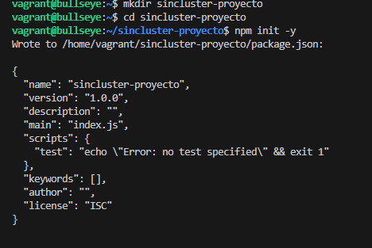
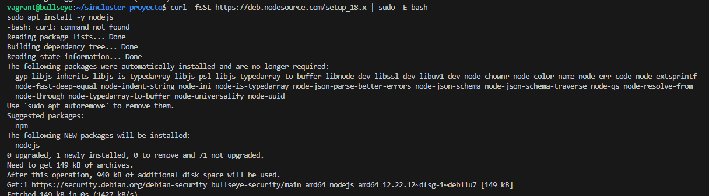
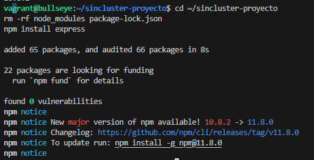
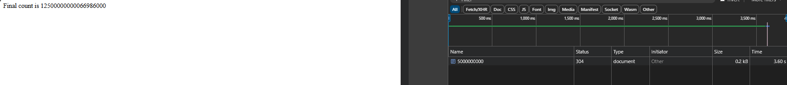
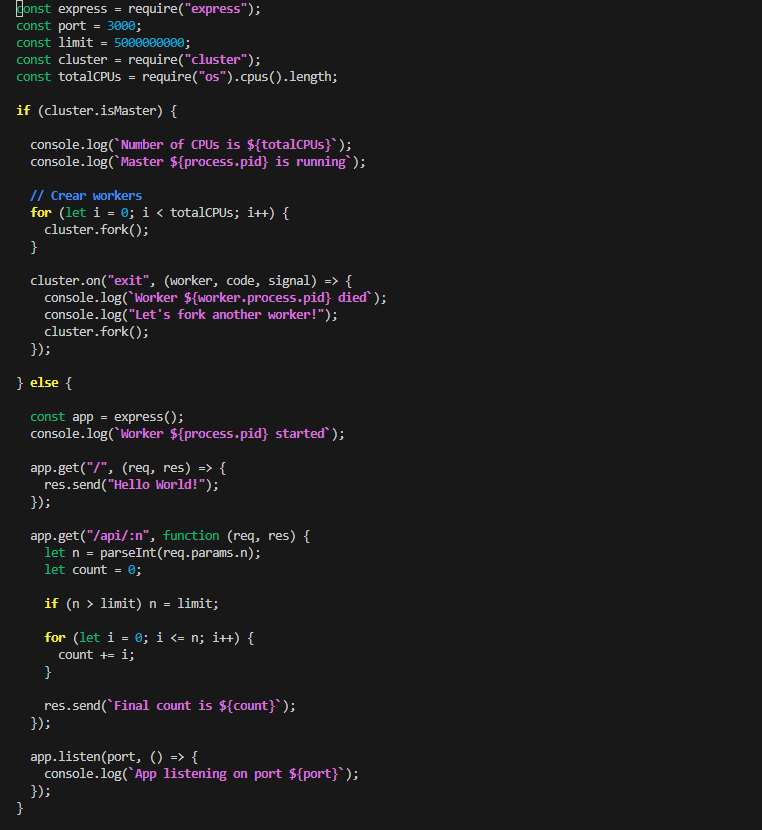
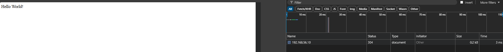

# Desplliegue cluster con NodeJS y Express #

- Lo primero que vamos ha hacer es intalar nodejs ya que no esta instalado.

## Proyecto Sin cluster ##

- Hay que crear una carpeta para el proyecto, se inicia con npm init para crear una estructura de carpetas automaticamente.

- Se Hace un npm install expres para instalar el proyecto: 

- Despues de esto creamos con nano un archivo app.js y añadimos el siguiente contenido y se ejecuta node:

- En mi caso, sale un error, que sucede por que la instalacion de node es una version antigua, sale por predeterminado, asi que busco la version mas reciente
- Borrar node.

- Reinstalarlo, con una version mas actual 

- Comprobamos

- Borramos expres por si da fallos

- Ya funcionaria y estaria la aplicacion escuchando por el puerto dicho "3000", para acceder tenemos que saber la ip y poner :3000

## Funcionamiento en Web ##

- Escribimos Hello World:

- Comprobacion Web

- se puede ver que va lento y cuando abrimos otra pagina vuelve a subir 

Como se ejecuta como unico proceso, sale asi.

## Proyecto Con cluster

- Se crea el archivo y lo modificamos con los siguientes datos: 

- Ejecutamos la app 

- Comprobamos otra vez los tiempos.

- Esta diferencia es porque se crean varios procesos workers al mismo puerto, entonces las peticiones se distribuyen entre ellos, permitiendo atender a multiples sulicitudes.
