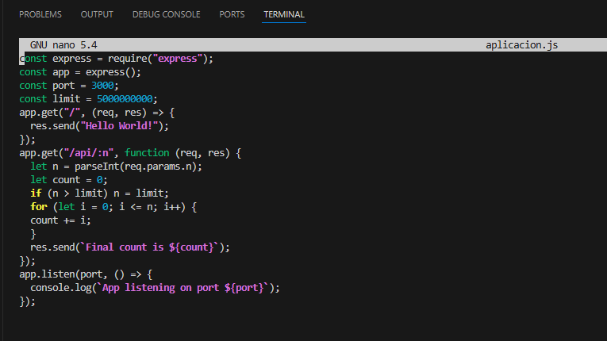
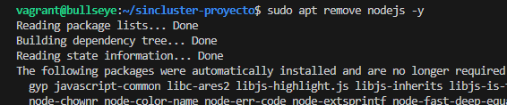
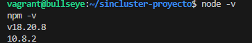
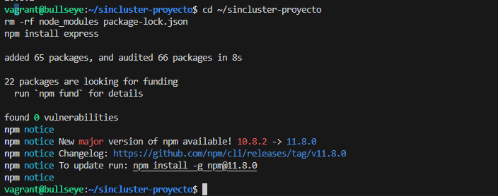
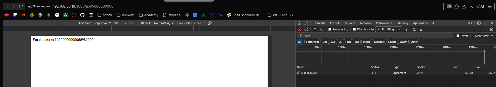
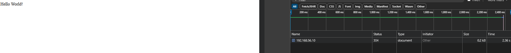
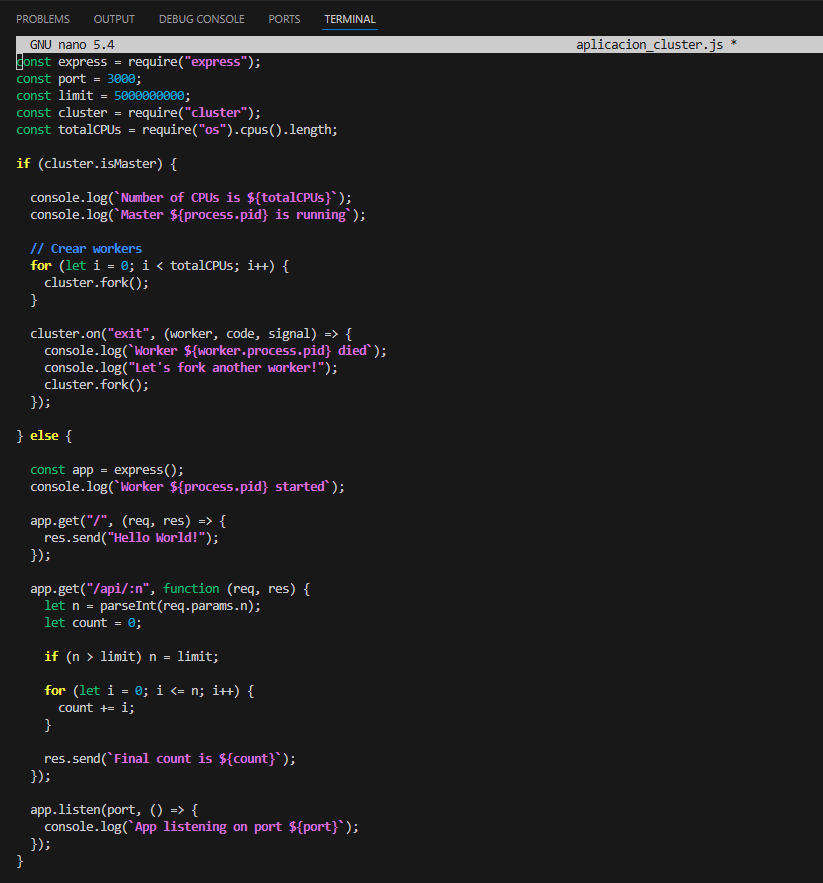
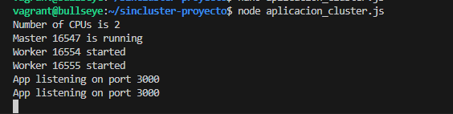
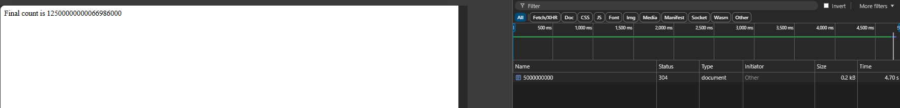
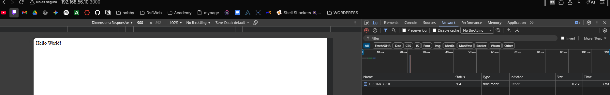

# Desplliegue de una aplicacion en cluster con NodeJS y Express
    - Lo primero que vamos ha hacer es intalar nodejs ya que no esta instalado.

## Sin cluster
- Creamos una carpeta para el proyecto, luego lo iniciamos con npm init para crear una estructura de carpetas automaticamente y el archivo packega.json.

- Lo siguiente es hacer un npm install expres para instalarlo para el proyecto 

- Despues de esto creamos con nano un archivo para la aplicacion.js y añadimos lo siguiente y ejecutamos node "nombre de nuestra applicación"

- En este momento me sale un error, que sucede por que la instalacion de node es una version antigua y los datos dentro de la aplicacion necesitan un node mas moderno, para esto tenemos que hacer lo siguiente
    - Borrar node.
    
    - Reinstalarlo, con una version mas actual 
    
    - Comprobamos
    
    -Borramos expres por si da fallos
    
- Ya funcionaria y estaria la aplicacion escuchando por el puerto dicho "3000", para acceder tenemos que saber la ip y poner :3000

-Vemos el tiempo que tarda, y a la vez abrimos otra pagina para ver como el valor sube 

(Esto sucede porque la aplicación sin clúster se ejecuta en unico proceso.)

## Con cluster
- Creamos el archivo con nano y añadimos lo siguiente 

- Ejecutamos la app 

- Comprobamos otra vez los tiempos.

(Esto es debido a que se crean varios procesos workers que comparten el mismo puerto, y las peticiones se distribuyen entre ellos, permitinedo atender a multiples solicitudes evitando bloqueos)